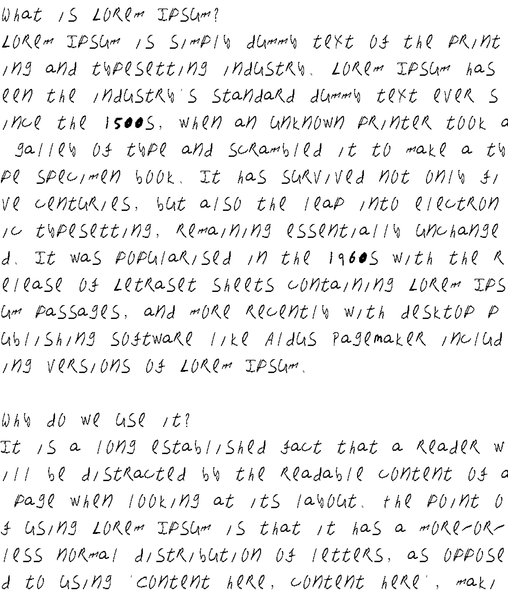

# CLI Tool for Handwritten Text Generator

## 📌 Overview
This project generates realistic handwritten text by assembling character images from a dataset and overlaying them onto a background. It processes input text and converts it into an image representation, mimicking a handwritten document. Additionally, it includes utilities for font extraction and preprocessing.

## Demo

<p align="center">
  <video width="12rem" src="https://github.com/user-attachments/assets/e3dd38a6-2283-41b4-a23a-7d12e827f38e"> </video>
</p>


## Output Images  

<p align="center">
  
  
</p>


## Analyze thresholds

<p align="center">
  
  
</p>


## Features
- **Text to Image Generation**: Converts given text into an image using character images.
- **Customizable Font Dataset**: Allows the use of custom handwritten fonts.
- **Image Processing Utilities**: Tools to extract, segment, and preprocess character images.
- **Automated Font Selection**: Randomly selects character images for variety.
- **Scalability**: Supports large text inputs and dynamically adjusts layout.

## Technologies Used
- **Golang**: Core logic for image rendering.
- **Python (OpenCV, NumPy, Matplotlib)**: Image preprocessing and font extraction.
- **gg (Go Graphics Library)**: Drawing and manipulating images.
- **x/image/draw**: Resizing and compositing images.

## Installation & Usage
### 1️⃣ Prerequisites
Ensure you have the following installed:
- **Go (Golang)**
- **Python 3.x**
- **OpenCV (Python)**: `pip install opencv-python numpy imutils matplotlib`

### 2️⃣ Setup
Clone the repository and navigate to the project directory:
```sh
git clone https://github.com/singhJasvinder101/go_writes
cd go_writes
```

### 3️⃣ Running the Text Generator
#### Generate Handwritten Image
```sh
go run main.go input.txt
```
If no input.txt file is provided, it defaults to `dummy.txt`.
```sh
go run main.go
```

#### Process & Extract Font Images (currently in Beta)
```sh
python3 generate_font.py
```
This extracts character images from `image.png` and saves them in `cropped_chars`.


## 📂 Project Structure
```
📦 project_root
├── 📜 main.go               # Golang script for text-to-image conversion
├── 📜 generate_font.py      # Python script for font extraction
├── 📜 analyze.py            # Image threshold analysis
├── 📜 convert.py            # Image preprocessing & resizing
├── 📂 archive               # Folder containing fonts
├── 📂 cropped_chars         # Processed character images
├── 🖼️ myfont/bg.png         # Background image for rendering text
├── 📜 dummy.txt             # Default text file
└── 📜 README.md             # Project documentation
```

## Customization
- **Change Font Style**: Replace character images in `archive/train copy`.
- **Modify Background**: Update `myfont/bg.png`.
- **Adjust Character Spacing**: Edit `charSpacing` and `spaceWidth` in `main.go`.

## Future Improvements
- Support for different handwriting styles.
- Implementing AI-based font synthesis.
- Enhancing text alignment and kerning.

## 👨‍💻 Contributors
- **Jasvinder Singh** (Project Developer)

Feel free to contribute, raise issues, or suggest improvements! 🚀

